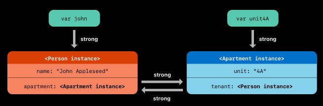
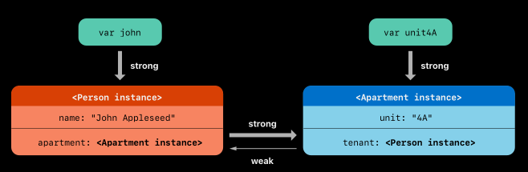
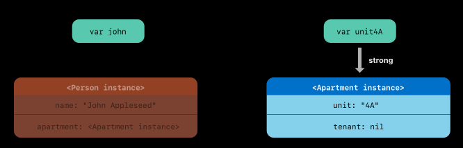
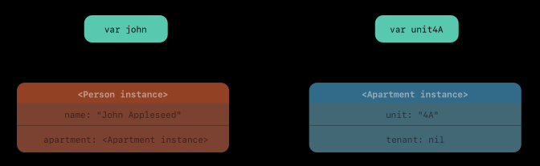

# Swift Interview Questions

# Core Swift Basics

### What are the main differences between `let` and `var`?

- `let` → constant binding: value cannot be reassigned after initialization.
- `var` → variable binding: value can be reassigned.
  
For reference types (classes), `let` means the reference cannot change, but the object’s properties can still mutate if they’re declared with `var`.

```swift
class Person {
    let name: String = "Alice" // Immutable property
    var age: Int = 30           // Mutable property
}

let alice = Person() // The 'alice' reference is constant

// This is valid, as 'age' is a 'var' property within the object:
alice.age = 31

// This causes a compile-time error, as 'name' is a 'let' property:
// alice.name = "Bob"

// This causes a compile-time error, as 'alice' is a 'let' reference:
// alice = Person()
```

For value types (like struct, enum, and tuples), the `let` keyword makes the entire instance immutable, along with all of its properties.

```swift
struct Coordinate {
    var x: Int // Declared as 'var' within the struct
    var y: Int // Declared as 'var' within the struct
}

let point = Coordinate(x: 10, y: 20) // The 'point' instance is constant

// This causes a compile-time error:
// point.x = 15
// error: cannot assign to property: 'point' is a 'let' constant
```

### What are value types vs reference types in Swift?

- Value types: `struct`, `enum`, `Tuple`. Copied on assignment and when passed to functions.
- Reference types: `class`, `actor`, `closures`. Passed by reference; multiple references point to the same instance.

For iOS, using value types helps avoid unintended shared mutable state and simplifies reasoning about concurrency.

### What is the difference between struct and class?

Key Differences:

- `struct` is a value type, `class` is a reference type.
- `class` supports inheritance; `struct` doesn’t(only through protocols).
- `class` supports deinitializers (deinit) and reference counting; `struct` doesn’t.
- `class` instances can be used with Objective-C runtime (@objc, dynamic) when appropriate.
- `class` is the base of Object Oriented Programming(OOP), `struct` is base of Protocol Oriented Programming(POP)

# Optionals & Error Handling

### What is an optional in Swift and why is it useful?

An Optional in Swift is a type that safely handles the absence of a value. An optional variable can hold one of two states:

1. It contains a value of a specific type (e.g., an `Int` or a `String`)
2. It contains `nil`, meaning there is no value present.

Optionals are not pointers; they are essentially an enumeration with two cases, `some(Value)` or `none`, which the compiler uses to enforce safety

- Type: `T?` means “either a value of type `T` or `nil`”
- Forces us to handle absence of a value explicitly, reducing runtime crashes like “null pointer exceptions”

We can unwrapped optional values using `if let`, `guard let`, optional chaining, nil coalescing operator `??`, or (carefully) `!`.

### When do we use `guard let` vs `if let`?

#### `guard Let`

- Used to exit early if the condition fails.
- Keeps the unwrapped value in scope for the remainder of the function.

```swift
func process(middleName: String?) {
    print("Starting process...")

    // Ensure we have a middle name to proceed. If not, exit immediately.
    guard let name = middleName else {
        print("Error: Required middle name not provided. Exiting function.")
        return // MUST exit the scope
    }

    // The unwrapped 'name' variable is available from here until the end of the function.
    let fullMessage = "The middle name is: \(name)"
    print(fullMessage)

    // ... main logic continues without indentation ...

    print("Process finished successfully with name: \(name).")
}
```

#### `if let`

Used for branching logic; unwrapped value is only available inside the `if` block.

```swift
func process(middleName: String?) {
    print("Starting process...")

    // The unwrapped 'name' variable is only available inside these braces {}
    if let name = middleName {
        let fullMessage = "The middle name is: \(name)"
        print(fullMessage)
        // ... more operations using 'name' ...
    } else {
        print("No middle name provided.")
    }

    // we cannot use 'name' here.
    print("Process finished.")
}
```

### What is error handling?

Error handling is the process of responding to and recovering from errors or unexpected issues that occur during a program's execution to prevent it from crashing or failing unexpectedly.

#### Key components of error handling

- **Error detection:** Identifying when an error has occurred, such as a file not being found or a network request failing.
- **Error reporting:** Informing the user or system administrator about the error, often through error codes, logs, or user-friendly messages.
- **Error recovery:** Implementing a strategy to deal with the error, which could include:
  - **Retrying the operation:** Attempting the task again.
  - **Providing a fallback:** Using a default value or alternative option.
  - **Cleaning up resources:** Releasing any resources that were acquired, even if an error occurred (often using a `finally` clause).
  - **Isolating the failure:** Preventing a failing component from bringing down the entire system.


#### Benefits of proper error handling

- **Increased reliability:** Programs are more stable and less likely to crash.
- **Better user experience:** Users are less likely to be frustrated by unexpected failures.
- **Improved security:** Properly handling errors can prevent vulnerabilities that could be exploited by attackers.
- **Easier debugging:** Detailed error logs make it simpler for developers to find and fix problems. 

### How does Swift handle errors? What’s the difference between `try?`, `try!`, and `try`?

Swift handles errors using a system of throwing, catching, propagating, and manipulating recoverable errors at runtime.

Errors are represented by types that conform to the `Error` protocol, often using an `enum` for specific error conditions.

Functions that can produce an error are marked with the `throws` keyword in their declaration.

The `try`, `try?`, and `try!` keywords are used when calling a function that is marked as `throws` to specify how potential errors should be handled:

#### `try`

Error is propagated and must be handled by a surrounding `do-catch` statement or the calling function (if it's also a throwing function).

**When to  use**

When we need to handle specific errors and potentially recover from them, or when we want to provide user feedback based on the error.

#### `try?`

If an error is thrown, the result is `nil`; otherwise, the result is an optional containing the return value.

**When to  use**

When we don't care about the specific error that occurred and just want to know if the operation succeeded or not (e.g., in a `guard let` statement).


#### `try!`

Force unwraps the result; if an error is thrown, the app will crash with a runtime error.

**When to  use**

Only when we are absolutely certain the operation will not fail (e.g., loading an image from a guaranteed-to-exist asset in our app bundle). Use with extreme caution.

```swift
enum DataError: Error {
    case invalidPath
    case insufficientPermissions
}

func processData(path: String) throws -> String {
    // some operations that can throw DataError
    if path.isEmpty {
        throw DataError.invalidPath
    }
    return "Processed Data"
}

// Using 'try' with do-catch
do {
    let result = try processData(path: "some/path")
    print("Success: \(result)")
} catch DataError.invalidPath {
    print("Error: Invalid file path.")
} catch {
    print("An unexpected error occurred: \(error)")
}

// Using 'try?'
let optionalResult = try? processData(path: "") // optionalResult will be nil

// Using 'try!' (will crash if an error is thrown)
// let guaranteedResult = try! processData(path: "") 
```

# Automatic Reference Counting (ARC) & Memory Management

### What is Automatic Reference Counting(ARC) in Swift?

Automatic Reference Counting (ARC) is Swift's automated memory management system, used to track and manage the memory used by our app's class instances. In most cases, this means memory management "just works" and we don’t need to think about memory management ourself.

**How Automatic Reference Counting (ARC) works**

#### Reference Counting

Every time we create a new instance of a class, Automatic Reference Counting (ARC) allocates a chunk of memory to store information about that instance. This memory holds information about the type of the instance, together with the values of any stored properties associated with that instance and places a "strong reference" to it in a property, constant, or variable.

#### Tracking References

Automatic Reference Counting (ARC) keeps track of the number of strong references to each object. A strong reference prevents an instance from being deallocated.

#### Deallocation

As long as at least one strong reference to an instance exists, Automatic Reference Counting (ARC) will not deallocate it. When the last strong reference is removed (e.g., a variable is set to nil or goes out of scope), ARC automatically deallocates the instance's memory, freeing up resources.

#### Scope

Automatic Reference Counting (ARC) applies only to class instances (reference types). Value types like structures and enumerations are not managed by ARC; their memory is typically managed on the stack.

**Resolving Strong Reference Cycles**

While Automatic Reference Counting (ARC) handles memory automatically in most scenarios, a problem can arise with **strong reference cycles (also known as retain cycles)**. A strong reference cycle occurs when two or more objects hold strong references to each other, preventing their reference counts from ever reaching zero and causing a **memory leak**.

To resolve these, Swift provides two alternative reference types:

#### Weak References

Declared with the `weak` keyword, a weak reference does not keep a strong hold on the instance it refers to, so it doesn't prevent deallocation. A weak reference must be an optional type because the referenced object can be deallocated and the reference automatically set to `nil` at any time. Use weak references when the other instance has a shorter lifetime.

#### Unowned References

Declared with the `unowned` keyword, an unowned reference also does not keep a strong hold on the instance. Unlike a weak reference, an unowned reference is a non-optional type and is used when we are certain the referenced instance will always have a value and has the same or a longer lifetime than the referencing object. Accessing an unowned reference after its instance has been deallocated will cause a runtime error.

### Strong References vs `weak` References vs `unowned` Reference

#### Strong Reference

A strong reference is the default type of reference in Swift. When we create a property, constant, or variable that refers to a class instance, it is a strong reference by default.

**Function:** A strong reference increments the instance's reference count based on its usage count. As long as there is at least one strong reference to an object, ARC will not deallocate it.

**Purpose:** This ensures that objects required by our program remain in memory as long as they are needed.

**Caution:** Strong references can lead to strong reference cycles (retain cycles) if two objects strongly refer to each other, causing a memory leak because neither object's reference count can reach zero.

```swift
class Person {
    let name: String
    
    init(name: String) {
        self.name = name
        print("\(name) is being initialized")
    }

    deinit {
        print("\(name) is being deinitialized")
    }
}
```

#### `weak` References

A weak reference is used to solve strong reference cycles.

**Function:** A weak reference does not increment the instance's reference count based on its usage count.

**Characteristics:**
- It must be declared as a variable (`var`) because its value needs to be changeable (set to `nil`).
- It must be an `Optional` type because the object it points to might be deallocated at any time, in which case the reference automatically becomes `nil`. 

**Purpose:** Use weak references when the referenced object can be deallocated independently, typically for a relationship where one object "owns" the other but the "owned" object does not need to own its "owner" back (e.g., a `Person` might strongly own a CreditCard, but the `CreditCard` should only weakly reference the `Person`).

#### `unowned` References

An `unowned` reference is also used to solve strong reference cycles in specific situations.

**Function:** Like a weak reference, it does not increment the instance's reference count.

**Characteristics:**
- It is used when we know the reference will never be nil once it has been set.
- It is declared as a non-optional type.
- Attempting to access an unowned reference after the object it points to has been deallocated will cause a runtime crash.

**Purpose:** Use unowned references when the other instance has the same or a longer lifespan. A common use case is a closure capturing `self` where `self` and the closure always deallocate at the same time.

| Reference Type | Contributes to Reference Count? | Optional? | Behavior When Object is Deallocated | When to Use | 
| -------------- | -------------- | -------------- | -------------- | -------------- | 
| Strong | Yes | No | Prevents deallocation; object remains in memory. | The default. Use for standard ownership where we need the object to persist.|
| `weak` | No | Yes (must be `Optional`) | Automatically sets the reference to `nil` when the object is deallocated. | When the referenced object has a shorter or independent lifespan. Used to break retain cycles. |
| `unowned` | No | No (non-optional) | Causes a runtime crash if accessed after the object is deallocated. | When the referenced object has the same or a longer lifespan. Used to break retain cycles when the reference is guaranteed to always be valid. | 


### What is a retain cycle? How do we break it?

A retain cycle happens when two (or more) reference types hold strong references to each other, so their reference counts never reach zero.

```swift
class Person {
    let name: String
    var apartment: Apartment?

    init(name: String) { 
        self.name = name
        print("\(name) is being initialized")   
    }

    deinit { 
        print("\(name) is being deinitialized") 
    }
}

class Apartment {
    let unit: String
    var tenant: Person?

    init(unit: String) { 
        self.unit = unit 
    }
    
    deinit { 
        print("Apartment \(unit) is being deinitialized") 
    }
}

var john: Person?
var unit4A: Apartment?

john = Person(name: "John Appleseed")
unit4A = Apartment(unit: "4A")

john!.apartment = unit4A
unit4A!.tenant = john
```

The above code creates retain cycle



Even after executing the following codes the objects will not be deinitialized

```swift
john = nil
unit4A = nil
```

Retain cycle persists


The strong references between the Person instance and the Apartment instance remain and can’t be broken.

We can resolve this situation with weak reference

```swift
class Person {
    let name: String
    var apartment: Apartment?

    init(name: String) { 
        self.name = name
        print("\(name) is being initialized")   
    }

    deinit { 
        print("\(name) is being deinitialized") 
    }
}

class Apartment {
    let unit: String
    weak var tenant: Person?

    init(unit: String) { 
        self.unit = unit 
    }
    
    deinit { 
        print("Apartment \(unit) is being deinitialized") 
    }
}

var john: Person?
var unit4A: Apartment?

john = Person(name: "John Appleseed")
unit4A = Apartment(unit: "4A")

john!.apartment = unit4A
unit4A!.tenant = john
```

Now, there is no retain cycle



```swift
john = nil
// Prints "John Appleseed is being deinitialized".
```



```swift
unit4A = nil
// Prints "Apartment 4A is being deinitialized".
```



### When would we use `weak` vs `unowned`?

We would use `weak` versus `unowned` based on the lifetimes and ownership relationship between the two related class instances in our code. Both are used to break strong reference cycles, but they handle the potential absence of the referenced object differently.

#### Use `weak` when 

- The referenced object can be `nil` (optional relationship) or has a shorter lifetime than the object holding the reference
- The connection between the two objects does not have to exist at all times.
- We need the reference to be automatically set to `nil` if the target object is deallocated first. This prevents potential crashes.
- Common Scenarios:
  - **Delegation Patterns:** The "delegate" (child) should not own the "delegator" (parent).
  - **Closures:** When capturing `self` in a closure where `self` might be released before the closure finishes executing (captured via `[weak self]` in the capture list).

A `weak` reference must be a `var` optional type in Swift:

```swift
class Person {
    var name: String
    weak var apartment: Apartment? // Apartment can be nil

    init(name: String) { 
        self.name = name 
    }
    
    deinit { 
        print("\(name) is being deinitialized") 
    }
}
```

#### Use `unowned` when

- The referenced object is guaranteed to be non-`nil` and has a lifetime that is the same length or longer than the object holding the reference (non-optional relationship).
- Since it's non-optional, it doesn't have the overhead of optional unwrapping or automatically being set to `nil`.
- Common Scenarios
  - **Guaranteed Parent/Child Links:** A parent object might own a child object, and the child holds an `unowned` reference back to the parent, because the parent will always exist as long as the child does.
  - **Closures:** When capturing `self` in a closure where the closure and `self` will always be deallocated at the same time (captured via `[unowned self]` in the capture list).

An `unowned` reference must be a non-optional type in Swift:

```swift
class CreditCard {
    let number: UInt64
    unowned let customer: Customer // A credit card must always have a customer

    init(number: UInt64, customer: Customer) {
        self.number = number
        self.customer = customer
    }
}
```

# Closures

### What is a closure in Swift?

A closure is a self-contained block of functionality that can be passed around and used in swift code. It it much like an unnamed function.

```swift
{ (parameters) -> returnType in
    // statements
}
```

#### Key Characteristics

- **First-Class Types:** Closures in Swift are first-class citizens, meaning they can be assigned to variables or constants, passed as arguments to functions, and returned from functions, just like a `String` or an `Int`.
- **Capturing Values:** A key feature is their ability to "close over" and access variables from their surrounding scope, even after the original scope has ceased to exist. Swift automatically handles the memory management for this.
- **Syntactic Flexibility:** Swift offers several syntax optimizations for writing closures in a brief and clear style, including inferring types from context, implicit returns for single-expression closures, shorthand argument names (like `$0`, `$1`), and trailing closure syntax.

#### Common Uses

- **Completion Handlers:** A function can start a long-running task (like a network request) and return immediately, using an escaping closure to execute code once the task is finished.
- **Higher-Order Functions:** They are used with methods like `map()`, `filter()`, and `sorted(by:)` to provide custom behavior for operations on collections (e.g., sorting an array in a specific order).
- **UI Event Handling:** In frameworks like SwiftUI, closures define the actions that occur when a user interacts with a UI element, such as tapping a Button. 

A simple closure that takes two integers and returns their sum:

```swift
let add: (Int, Int) -> Int = { (a, b) in
    return a + b
}
let result = add(5, 6)
// result is 11
```

This can be shortened using type inference and an implicit return for single-expression closures:

```swift
let add = { (a, b) in a + b }
add(5, 6)
```

```swift
// Or even shorter with shorthand argument names:
let add: (Int, Int) -> Int = { $0 + $1 }
add(5, 6)
```

### Explain capture lists in closures

A capture list in a Swift closure is a mechanism that allows us to explicitly control how values from the surrounding scope are captured and managed within the closure's memory. It is written as a comma-separated list of items inside square brackets `[]` before the closure's parameter list or the `in` keyword.

The primary reasons for using a capture list are to:

- Prevent strong reference cycles (retain cycles), which cause memory leaks when two objects hold strong references to each other.
- Control whether a variable is captured by reference (the default behavior) or by value (creating a copy at the time of the closure's creation).

The capture list is placed at the very beginning of the closure expression

```swift
let closure = { [capture list] (parameters) -> returnType in
    // Closure body
}
```

#### Capturing Reference Types (Weak and Unowned)

When dealing with class instances (reference types), the default behavior is a strong capture, which increments the object's reference count and can lead to retain cycles. Capture lists are used to specify a different kind of reference.

#### `weak`

This creates a `weak` reference to the instance, which does not keep a strong hold on the object and does not increment its reference count. The captured value becomes an `optional`, allowing it to be set to `nil` automatically if the original object is deallocated. We should use `weak` when the captured reference might become `nil` at some point during the closure's lifetime.

```swift
DispatchQueue.main.asyncAfter(deadline: .now() + 1) { [weak self] in
    guard let self else { // Safely unwrap the weak reference
        return 
    }

    self.performTask()
}
```

#### `unowned` 

This is similar to a weak reference in that it doesn't create a strong reference, but the captured value is assumed to always be valid (non-optional) for the lifetime of the closure. If the object is deallocated and the closure tries to access it, the application will crash. Use `unowned` only when we are certain that the captured instance will never be nil while the closure is executing.

```swift
// Example where 'owner' is guaranteed to exist as long as the 'closure' exists
let closure = { [unowned owner] in
    owner.performTask() // No need for optional chaining
}
```

In a nutshell, `weak` and `unowned` do the same thing but in case of unowned we don't need the overhead of unwrapping it ourself. But we need to be sure that `unowned` literals does not contains `nil` ever otherwise we will face crush.

### What does “escaping closure” mean?

An escaping closure is a closure that is called after the function it was passed into has returned. 

The term "escaping" refers to the closure's ability to "escape" the scope of the function body it was defined within.

In Swift, closures are non-escaping by default, which means they must be executed within the body of the function they are passed to, and the compiler ensures their memory is cleaned up as soon as the function returns.

When we mark a closure parameter with the `@escaping` attribute, we are explicitly telling the compiler that the closure's execution might be deferred or stored for later use.

#### How Escaping Closures Work

The primary characteristic of an escaping closure is that it requires special memory management and might involve strong reference cycles if not handled carefully.

Step by Step breakdown of how escaping closures work

1. **Function Call:** A function is called with an escaping closure as an argument.
2. **Function Returns:** The function finishes its immediate execution and returns to the caller.
3. **Closure is Stored or Deferred:** The closure is stored somewhere outside the function's scope—perhaps in a property of a class instance, or on a different execution queue (like a background thread).
4. **Closure Executes Later:** The closure is executed at a later time, long after the original function call is finished.

#### Common Use Cases

- **Asynchronous Operations:** Network requests are a classic example. Start a data fetch in a function, but the closure that processes the data (the completion handler) can only run when the network response returns, which might be seconds later.
- **Delegates and Callbacks:** Storing a closure as a property of a class to be used as a callback mechanism.
- **Dispatch Queues:** Executing a closure on a background thread using.
- **Animations:** Providing a block of code to run once an animation has completed.

```swift
var completionHandlers: [() -> Void] = []

// The function needs `@escaping` because the closure is stored in an array 
// and will be executed *after* the `someFunctionWithEscapingClosure` returns.
func someFunctionWithEscapingClosure(completionHandler: @escaping () -> Void) {
    completionHandlers.append(completionHandler)
    // The function immediately returns, but the closure lives on in the array.
}

// In contrast, this non-escaping closure runs immediately inside the function's scope.
func someFunctionWithNonEscapingClosure(closure: () -> Void) {
    closure()
}
```

#### Memory Management Consideration

Because escaping closures can hold strong references to self within a class instance, they are the main cause of retain cycles in Swift.

When we use an escaping closure within a class method, the compiler requires us to explicitly reference self, often forcing us to use a capture list (`[weak self]`) to break potential retain cycles and prevent memory leaks.

# Protocols & Protocol-Oriented Programming

### What is a protocol in Swift?

In Swift, a protocol defines a blueprint of methods, properties, and other requirements that suit a particular task or piece of functionality.

It can be adopted by classes, structs and any other types.

```swift
protocol Drivable {
    var speed: Double { get set }
    func startEngine()
    func accelerate(by amount: Double)
}

class Car: Drivable {
    var speed: Double = 0.0

    init(speed: Double) {
        self.speed = speed
    }

    func startEngine() {
        print("Car engine started.")
    }

    func accelerate(by amount: Double) {
        speed += amount
        print("Car accelerating to \(speed) mph.")
    }
}

struct Bicycle: Drivable {
    var speed: Double = 0.0

    func startEngine() {
        print("Bicycle does not have an engine.")
    }

    func accelerate(by amount: Double) {
        speed += amount / 2 // Bicycles accelerate differently
        print("Bicycle accelerating to \(speed) mph.")
    }
}
```

Swift Protocols also support

- **Protocol Extension**
- **Protocol Inheritance**
- **Protocol Composition**

### What is Protocol-Oriented Programming (POP) in Swift?

Protocol Oriented Programming is a protocol first approach instead of class first approach of Object oriented Programming.

The Pillars of Protocol-Oriented Programming (POP)

- **Protocol Extension:** For Default Implementation
- **Protocol Inheritance:** Add further requirements on top of the requirements it inherits.
- **Protocol Composition:** Allowing a type to conform multiple protocols

Protocol-Oriented Programming (POP) emphasis on these pilar along with value types like struct and enum rather than classes.

[Protocols Oriented Programming in Details](https://github.com/Imran4424/SwiftProblemNSolution/blob/master/25.ProtocolOrientedProgramming/ProtocolOrientedProgramming.md)

### What is protocol extension and why is it useful?

A protocol extension adds default implementations of methods and computed properties to a protocol, allowing any type that conforms to the protocol to automatically gain that functionality.

This is useful for promoting code reuse, creating a single source of truth for common behavior, and allowing conforming types to provide their own custom implementations or use the defaults provided.

```swift
protocol Entity {
    var name: String { get set }
    static func uid() -> String
}

extension Entity {
    static func uid() -> String {
        return UUID().uuidString
    }
}

struct Order: Entity {
    var name: String
    let uid: String = Order.uid()
}
```

### What is “protocol with `associatedtype”` and why is it tricky?

In Swift, "protocol with `associatedtype`" usually means a protocol that has an `associatedtype` requirement—often called a PAT (Protocol with Associated Type).

Associated types allow protocols to be generic and flexible without the user of the protocol having to specify every type parameter explicitly.

A classic example from the Swift standard library is the `Collection` protocol:

```swift
protocol Collection {
    associatedtype Element
    // ... other requirements using Element, Index, etc.
}
```

When conforming protocol which `associatedtype` we can explicitly define the associated type.

```swift
struct MyIntegerStack: Collection {
    typealias Element = Int // Explicitly defining the associated type
    // but this is optional, we can skip this still the code will work as expected

    private var elements: [Int] = []

    // Example requirement: a method that returns the count
    var count: Int {
        return elements.count
    }
    
    // Example requirement: a method to add an element
    mutating func push(_ element: Element) { // Uses the defined Element type (Int)
        elements.append(element)
    }

    // Example requirement: a method to check if the collection is empty
    var isEmpty: Bool {
        return elements.isEmpty
    }
}

var stack = MyIntegerStack()
stack.push(10)
stack.push(20)

print(stack.count) // Output: 2
print(stack.isEmpty) // Output: false
```

But defining the associated type explicitly is optional, let's see another example without defining the associated type explicitly.

```swift
struct SetOfNames: Collection {
    // We don't need 'typealias Element = String'
    // since this is optional

    private var names: Set<String> = []

    // The compiler sees this returns String, so it infers Element is String
    func getName(at index: Int) -> String? {
        // Implementation omitted for brevity
        return names.first
    }
    
    // The compiler sees this accepts a String, so it infers Element is String
    mutating func insert(_ name: String) {
        names.insert(name)
    }

    var isEmpty: Bool {
        return names.isEmpty
    }
}
```

#### Why they are tricky?

The primary difficulty lies in the constraint they place on how they can be used: **a protocol with an associated type (or `Self` requirements) cannot be used as a standalone type** in variable declarations, function parameters, or collection elements (before recent Swift updates, which added partial solutions like `some` and `any` keywords).


##### Loss of Abstraction (The "Existential" Problem)

We cannot declare a simple variable of that protocol type.

```swift
// this will not compile
// Error: 'Collection' can only be used as a generic constraint
var myCollection: Collection = SetOfNames() 
```

The compiler cannot know the size or specific methods of the underlying type because different conforming types could have different associated types (UInt8, String, etc.).

##### Requires Generics (Workarounds)

To use them, we typically must wrap the usage in a generic constraint:

```swift
// This is the correct, compiling way to write generic code that accepts any collection:
func process<T: Collection>(_ collection: T) {
    // ... code that works on any T, as long as it's a Collection ...
}
```

This forces the client code to become generic, which can propagate through a codebase and add complexity.

##### Complexity in Heterogeneous Collections

Storing different concrete types that conform to the same associated type protocol in a single array is not straightforward.

For instance, we cannot create an `Array<Collection>` that holds both `MyIntegerStack` and `SetOfNames`.

```swift
var stack = MyIntegerStack()
var uniqueNames = SetOfNames() 

// the following one will give compilation error
// Error: 'Collection' can only be used as a generic constraint
let collectionArray: [Collection] = [stack, uniqueNames]
```

##### Compiler Inference Issues

While Swift is good at inferring associated types in simple cases, complex interactions between multiple protocols with associated types can sometimes lead to obscure compiler errors and force the developer to add explicit type annotations or complex constraints.

```swift
import Foundation

// 1. First Protocol: A data producer
protocol Producer {
    associatedtype Output
    func generate() -> Output
}

// 2. Second Protocol: A data consumer/processor
protocol Processor {
    associatedtype Input
    associatedtype Output
    func process(_ input: Input) -> Output
}

// 3. A type intended to be both:
// A type that produces a String AND processes a String into a Data object
struct StringToDataManager: Producer, Processor {
    
    // Conforms to Producer: Output is String
    func generate() -> String {
        return "Some input string"
    }
    
    // Conforms to Processor: Input is String, Output is Data
    func process(_ input: String) -> Data {
        return input.data(using: .utf8) ?? Data()
    }
}

// 4. The tricky part: A generic function that requires a type conforming to *both* protocols.

/* 
 * ❌ COMPILER ERROR SCENARIO ❌
 * The compiler struggles to reconcile that the 'Output' of Producer 
 * MUST be the 'Input' of the Processor when both are applied to a single generic type T.
 */

// This generic function will often produce a vague compiler error, such as:
// "Protocol 'Processor' requires 'Input' be specialized" or
// "Generic parameter 'T' could not be inferred"
func executePipeline<T: Producer & Processor>(item: T) {
    // The compiler can't automatically guarantee T.Producer.Output == T.Processor.Input
    let intermediate = item.generate()
    let finalResult = item.process(intermediate)
    print("Final result size: \(finalResult.count) bytes")
}

// Attempting to call this function results in the inference failure:
// executePipeline(item: StringToDataManager()) 
```

To resolve the ambiguity and satisfy the compiler, we must explicitly state that the associated types are identical:

**Solution A: Add an explicit `where` clause constraint to the generic function**

This fixes the compiler error by telling Swift to enforce the required relationship between the associated types:

```swift
// --- The Fix: Adding explicit constraints or typealiases ---
func executePipelineFixed<T>(item: T) where T: Producer, T: Processor, T.Output == T.Input {
    let intermediate = item.generate() // T.Output
    let finalResult = item.process(intermediate) // T.Input matches T.Output
    print("Final result size: \(finalResult.count) bytes")
}

// This now compiles correctly
executePipelineFixed(item: StringToDataManager()) 
// Output: Final result size: 19 bytes
```

**Solution B: Use `typealias` in the custom type to make the association explicit**

Alternatively, we could add a `typealias` within `StringToDataManager` to help the compiler map the types clearly:

```swift
struct StringToDataManagerFixed: Producer, Processor {
    // Explicitly confirm the link between the two roles' associated types
    typealias Input = String 
    // Output is inferred as String for Producer, Data for Processor

    func generate() -> String {
        return "Some input string"
    }
    
    func process(_ input: String) -> Data {
        return input.data(using: .utf8) ?? Data()
    }
}
```

#### Exceptions

Below showing an exception of standard protocol with associated type as computed property with `some` 

This usually requires using type-erasure techniques (creating "wrapper" types like Swift's `AnySequence` or `AnyHashable`).

```swift
import SwiftUI

struct ContentView: View {
    var body: some View {
        Text("Hello, world!")
    }
}
```

# Generics & Type System

### Explain generics in Swift.

Generics are a powerful feature in Swift that allow us to write flexible, reusable code that can work with any type, while still providing type safety at compile time

Instead of writing a function or a data structure that only handles `Int`, or only handles `String`, we can write it once in a generic way, and the compiler automatically adapts it for the specific types we use.

Generics achieve their flexibility by introducing type placeholders, often represented by simple letters like `T` (for Type), `Element`, or `Key` and `Value`.

let's look at a non-generic function

```swift
func swapTwoInts(_ a: inout Int, _ b: inout Int) {
    let temporaryA = a
    a = b
    b = temporaryA
}
```

Now, Let's make this a generic function which can work with `Int`, `Float`, `Double`, `String`, etc.

```swift
// T is a placeholder for a specific type
func swapTwoValues<T>(_ a: inout T, _ b: inout T) {
    let temporaryA = a
    a = b
    b = temporaryA
}
```

Here, `T` is name of the type parameter which is working as a generics, it can be anything.

```swift
// Element is a placeholder for a specific type
func swapTwoValues<Element>(_ a: inout Element, _ b: inout Element) {
    let temporaryA = a
    a = b
    b = temporaryA
}
```

In above code, we used `Element` instead of T, which will work just fine. Using `T` as generic type Parameter name is long standing convention in Programming Languages with Generics (Like C++, C#, Java). That's why we will see `T` more often in others code.

But Swift's documentation and best practices encourage using more descriptive names for type parameters when they convey a specific meaning or relationship within the generic type or function.

For example:

- `Element` in `Array<Element>`
- `Key` and `Value` in `Dictionary<Key, Value>`

### What is type erasure and where might you use it in iOS?

Type erasure is a programming technique used in Swift to circumvent the constraints imposed by generic types and protocols with associated types (`PATs`) when we need to store them in non-generic containers like standard arrays or pass them as opaque function arguments.

It involves wrapping an instance of a specific, concrete generic type within a generic wrapper struct or class whose own generic information is less specific (often using `Any` as a placeholder) to present a uniform interface to the rest of the codebase.

```swift
protocol Collection {
    associatedtype Element
    // ... other requirements using Element, Index, etc.
}

struct MyIntegerStack: Collection {
    private var elements: [Int] = []

    // Example requirement: a method that returns the count
    var count: Int {
        return elements.count
    }
    
    // Example requirement: a method to add an element
    mutating func push(_ element: Element) { // Uses the defined Element type (Int)
        elements.append(element)
    }

    // Example requirement: a method to check if the collection is empty
    var isEmpty: Bool {
        return elements.isEmpty
    }
}

struct MyIntegerQueue: Collection {

    private var elements: [Int] = []

    // Example requirement: a method that returns the count
    var count: Int {
        return elements.count
    }
    
    // Example requirement: a method to add an element
    mutating func push(_ element: Element) { // Uses the defined Element type (Int)
        elements.append(element)
    }

    mutating func pop() -> Element {
        return elements.removeFirst()
    }

    // Example requirement: a method to check if the collection is empty
    var isEmpty: Bool {
        return elements.isEmpty
    }
}

var stack = MyIntegerStack()
var queue = MyIntegerQueue() 

// the following one will give compilation error
// Error: 'Collection' can only be used as a generic constraint
let collectionArray: [Collection] = [stack, queue]
```

The above code will give us compilation error because of associatedtype Protocol used a variable type. To fix this we need to use Type erasure technique

```swift
// A concrete, non-generic wrapper struct
struct AnyCollection<Element>: Collection {
    
    // Store references to the underlying operations using closures
    private let _push: (Element) -> Void
    private let _isEmpty: () -> Bool
    private let _count: () -> Int

    // The initializer accepts any concrete type 'C' that conforms to the original protocol
    init<C: Collection>(_ collection: C) where C.Element == Element {
        // Forward the specific implementations via closures
        self._push = collection.push
        self._isEmpty = { collection.isEmpty }
        self._count = { collection.count }
    }

    // Now, AnyCollection implements the requirements by calling the stored closures
    var count: Int {
        return _count()
    }

    mutating func push(_ element: Element) {
        _push(element)
    }

    var isEmpty: Bool {
        return _isEmpty()
    }
}

var stack = MyIntegerStack()
var queue = MyIntegerQueue() 

// now, this gonna compile
let collectionArray: [AnyCollection<Int>] = [AnyCollection(stack), AnyCollection(queue)]
```

#### Where to Use Type Erasure in iOS Development

Type erasure is primarily used in scenarios where we are working with complex, modular architectures and need flexibility in handling diverse data types uniformly. It is prevalent in the Combine framework and any system heavily reliant on generic abstraction.

- When we want to return different concrete generic types behind a single API.
- When we need to store heterogeneous generic instances in a collection.

#### The Combine Framework (`AnyCancellable`, `AnyPublisher`)

The Swift Combine framework makes extensive use of type erasure in its public API to simplify how data streams are managed.

**AnyCancellable**

When we subscribe to a publisher, we get a cancellable object back. Different publishers produce different, highly specific `Cancellable` types internally. Combine erases these specific types into the universal `AnyCancellable` wrapper. This allows we to store all subscription tokens in a single `Set<AnyCancellable>` without worrying about their internal generic types.

**AnyPublisher**

We often want a function to return a publisher without revealing all the complex, internal chaining operations used to create it (e.g., a `map`, `filter`, and decode chain). `AnyPublisher` hides these implementation details, offering a clean, simple return type for our APIs.


#### SwiftUI framework

Type erasure in SwiftUI, most notably through `AnyView`, addresses the challenge of working with heterogeneous view types where the specific underlying view type is not known or needs to be hidden.

If we need to return different concrete View types based on certain conditions, `AnyView` can wrap these different views, making them appear as a single AnyView type to the caller.

```swift
struct ConditionalView: View {
    let showText: Bool

    var body: some View {
        if showText {
            AnyView(Text("Hello, World!"))
        } else {
            AnyView(Image(systemName: "star.fill"))
        }
    }
}
```

We cannot directly create an array of View protocol instances if they have associated types or if the specific concrete types are different. `AnyView` allows us to store different view types within a collection by wrapping them.

```swift
var views: [AnyView] = [
    AnyView(Text("Item 1")),
    AnyView(Button("Tap Me") { print("Tapped") })
]
```

#### Type Erasure in Network Calls

Consider a scenario where we define a NetworkRequest protocol with an associated type for the expected ResponseType:

```swift
protocol NetworkRequest {
    associatedtype ResponseType: Decodable
    var url: URL { get }
    func decode(data: Data) throws -> ResponseType
}
```

This protocol works well for individual requests. However, if we want to store a collection of different `NetworkRequest` types (e.g., an array of requests with different ResponseTypes) or pass them as arguments to a generic network client, we encounter a compiler error because protocols with associated types cannot be used as concrete types.

**Fix the situation with Type Erasure**

Type erasure provides a solution by creating a concrete, non-generic wrapper type that conforms to the protocol and internally stores an instance of the specific concrete type. This wrapper effectively "erases" the associated type information from the public interface, allowing us to treat different concrete implementations of `NetworkRequest` uniformly.

```swift
struct AnyNetworkRequest<T: Decodable>: NetworkRequest {
    typealias ResponseType = T

    private let _url: URL
    private let _decode: (Data) throws -> T

    init<R: NetworkRequest>(erasing request: R) where R.ResponseType == T {
        self._url = request.url
        self._decode = request.decode
    }

    var url: URL { 
        return _url 
    }

    func decode(data: Data) throws -> T {
        try _decode(data)
    }
}

struct User: Decodable { /* ... */ }
struct Product: Decodable { /* ... */ }

struct UserRequest: NetworkRequest {
    typealias ResponseType = User
    
    var url: URL { 
        return URL(string: "https://api.example.com/users")! 
    }
    
    func decode(data: Data) throws -> User { 
        return try JSONDecoder().decode(User.self, from: data) 
    }
}

struct ProductRequest: NetworkRequest {
    typealias ResponseType = Product
    
    var url: URL { 
        return URL(string: "https://api.example.com/products")! 
    }

    func decode(data: Data) throws -> Product { 
        return try JSONDecoder().decode(Product.self, from: data) 
    }
}

let userRequest = AnyNetworkRequest(erasing: UserRequest())
let productRequest = AnyNetworkRequest(erasing: ProductRequest())

// we can't put them in the same array if their ResponseTypes are different
// let requests: [AnyNetworkRequest] = [userRequest, productRequest] // Compiler error if T is not specified

// But if we had different requests all returning the same ResponseType, we could:
// let userRequests: [AnyNetworkRequest<User>] = [AnyNetworkRequest(erasing: UserRequest()), AnyNetworkRequest(erasing: AnotherUserRequest())]
```

# Concurrency (Modern Swift)

### What is the difference between GCD and Swift Concurrency (`async/await`)?

#### Grand Central Dispatch (GCD)

- **Lower-level and C-based**: Built on C-level APIs, providing lower-level control over threading.
- **DispatchQueues**: Uses dispatch queues (like `DispatchQueue`) to manage tasks, which can be serial or concurrent.
- **Callback-based:** Work is often managed using closures and callbacks, which can lead to complex nested code.
- **Manual management:** Requires more manual management for tasks like dependency and cancellation, and doesn't have built-in support for cancellation.
- **Best for:** Legacy code, ultra-low-level threading needs, or when we need very fine-grained control. 

#### Swift Concurrency (`async/await`)

- **Higher-level and Swift-native:** A modern Swift language feature that simplifies asynchronous programming.
- **Structured concurrency:** Provides a structured way to manage task lifetimes, cancellation, and error handling.
- `async/await` keywords: Uses `async` to mark functions that can be suspended and `await` to call them, making asynchronous code look and feel more synchronous and readable.
- **Built-in support:** Includes built-in support for error handling with `do-catch` and cooperative cancellation.
- **Best for:** Modern Swift projects, improving code readability, and managing complex asynchronous flows where structured concurrency is beneficial. 

### How do you mark an async function and call it?

#### Marking an `async` function

To declare a function as asynchronous, we need to use the `async` keyword after the function's parameter list and before its return type. This signifies that the function might perform operations that can suspend its execution without blocking the calling thread.

```swift
func fetchData() async -> String {
    // Simulate an asynchronous operation, e.g., a network request
    await Task.sleep(2 * 1_000_000_000) // Sleep for 2 seconds
    return "Data fetched successfully!"
}

func performCalculations() async throws -> Int { // An async function that can also throw an error
    // Simulate a potentially failing asynchronous operation
    if Bool.random() {
        throw SomeError.calculationFailed
    }
    
    await Task.sleep(1 * 1_000_000_000)
    
    return 42
}

enum SomeError: Error {
    case calculationFailed
}
```

#### Calling an `async` function

To call an `async` function, the calling code must also be within an `async` context. Then we must use the `await` keyword before calling the asynchronous function. This signals that the execution might pause at this point until the `async` function completes and returns its result. 

```swift
func loadAndProcessData() async {
    let data = await fetchData() // Call fetchData and await its result
    print(data)

    do {
        let result = await performCalculations() // Call performCalculations and await its result (handling potential errors)
        print("Calculation result: \(result)")
    } catch {
        print("Error during calculation: \(error)")
    }
}
```

If we need to call an `async` function from a synchronous context (e.g., from an `@IBAction` or `onAppear` in SwiftUI), we can wrap the call within a `Task`:

```swift
// Example in a synchronous context (e.g., a button action)
Task {
    await loadAndProcessData() // Call the async function within a Task
}
```

### What is an `actor` in Swift?

In Swift, an **actor is a reference type** that acts as a thread-safe container for mutable state, designed specifically to prevent data races in concurrent environments.

It achieves this safety by ensuring that only one task can access or modify its internal data at any given time, a concept known as actor isolation.

#### Key Concepts

- **Data Race Prevention:** The primary purpose of an actor is to eliminate data races, which occur when multiple threads access and modify shared memory simultaneously, leading to unpredictable crashes and data corruption.
- **Serial Execution:** An actor manages its operations internally using a private serial executor (queue). This means that even if multiple tasks try to access an actor's methods at the same time, they are processed one after another, in a synchronized manner.
- **Asynchronous Access:** Accessing an actor's mutable properties or methods from outside the actor's own context requires the `await` keyword. This marks a potential suspension point, allowing the actor to process other pending tasks while the calling task waits for access, preventing the calling thread from being blocked.
- **Reference Type:** Actors are reference types, similar to classes, meaning that copies refer to the same underlying instance in memory.
- **No Inheritance:** Unlike classes, actors do not support inheritance, which simplifies their concurrency model.
- **`@MainActor`:** Swift includes a special "global actor" called `@MainActor`, which guarantees that all annotated code runs on the main thread. This is essential for safely updating UI elements in frameworks like UIKit and SwiftUI.

```swift
actor BankAccount {
    private var balance: Double = 0.0 // Mutable state is isolated

    func deposit(amount: Double) { // This method is actor-isolated
        balance += amount
    }

    func withdraw(amount: Double) { // This method is actor-isolated
        if balance >= amount {
            balance -= amount
        }
    }
    
    // Immutable properties are non-isolated by default and can be accessed synchronously
    let accountNumber: Int = 12345
}

// Accessing the actor's methods from an external, potentially concurrent, context
func performTransactions() async {
    let account = BankAccount()

    // 'await' is required when calling an actor's isolated methods
    await account.deposit(amount: 100)
    await account.withdraw(amount: 50)
    
    // Immutable properties can be accessed directly
    print("Account Number: \(account.accountNumber)") 
}
```

In short, actor is a variation of class concept with the limitation of no inheritance support for making the code thread-safe.

### What is the `@MainActor` attribute used for?

The `@MainActor` attribute in Swift is a special global actor used to ensure that the code it annotates always executes on the app's main thread.

This is vital in application development because all UI-related operations (like updating a label, button, or SwiftUI view) must occur on the main thread to prevent crashes, data races, and unpredictable behavior. 

#### Primary Purpose

The core function of `@MainActor` is to provide compile-time safety guarantees that the annotated code runs in the main thread's execution context.

Previously, developers had to manually manage this with `DispatchQueue.main.async { ... }`.

The `@MainActor` attribute streamlines this process, allowing the Swift compiler to automatically dispatch the necessary code to the main thread when called from a background task, making the code cleaner and less error-prone.

#### Usage

**Entire classes or structs**

Marking an entire type with `@MainActor` ensures that all methods and properties within it are isolated to the main thread. This is common for UI-related classes, such as `UIViewController` subclasses, `ObservableObject` view models in SwiftUI, and `View` structs themselves in newer Swift versions.

```swift
@MainActor
class UserProfileViewModel: ObservableObject {
    @Published var username: String = "" // Guaranteed to update on main thread

    func loadData() async {
        // ... fetch data in background ...
        let fetchedName = "New Name" 
        self.username = fetchedName // This assignment is safe
    }
}
```

**Individual functions or properties** 

For types that perform both background work and UI updates, we can mark specific functions or properties with `@MainActor` for granular control.

```swift
func processImageDataInBackground() async -> UIImage {
    // Heavy image processing happens off the main thread
    // ... 
    await updateStatusLabel() // Hops back to main actor to update UI
    return resizedImage
}

@MainActor
func updateStatusLabel() {
    // This runs only on the main thread
    statusLabel.text = "Processing Complete"
}
```

**Closures**

We can also use `MainActor.run { ... }` to execute a specific block of code on the main thread when needed.

```swift
import SwiftUI

struct ContentView: View {
    @State private var message: String = "Initial Message"

    var body: some View {
        VStack {
            Text(message)
                .font(.title)
                .padding()

            Button("Fetch Data and Update UI") {
                Task {
                    // Simulate a background operation that fetches data
                    let fetchedData = await fetchDataFromNetwork()

                    // Switch to the MainActor to update UI
                    await MainActor.run {
                        self.message = "Data fetched: \(fetchedData)"
                    }
                }
            }
        }
    }

    // Simulate an asynchronous network request or heavy computation
    private func fetchDataFromNetwork() async -> String {
        try? await Task.sleep(for: .seconds(2)) // Simulate network delay
        return "New Data"
    }
}
```

#### Key Benefits

- **Compiler Enforcement:** The Swift compiler actively checks for violations. If we try to access a `@MainActor`-isolated property from a non-isolated background context without using `await`, the compiler will produce an error, preventing runtime crashes.
- **Cleaner Syntax:** It removes the boilerplate of manual `DispatchQueue.main.async` calls.
- **Seamless Integration:** It integrates smoothly with Swift's modern concurrency features (`async/await`, `Task`)


### What is `Sendable` and why does it matter?

The `Sendable` protocol in Swift is a marker protocol that assures the compiler a type can be safely shared across different concurrency domains (tasks or actors) without causing data races or memory corruption.

It has no methods or properties to implement; it is a compile-time guarantee of thread safety.

#### Why `Sendable` Matters

The importance of `Sendable` lies in Swift's modern concurrency model, which aims to eliminate data races at compile time rather than runtime. A data race occurs when multiple tasks access the same mutable memory location simultaneously, and at least one of them is performing a write operation, leading to unpredictable and hard-to-debug bugs. 

By enforcing `Sendable` conformance, the compiler provides several crucial benefits:

- **Prevents Data Races:** The primary goal is to prevent crashes and corrupted data that arise from unsafe concurrent access to shared mutable state.
- `Compile-Time Safety:` Instead of finding subtle threading bugs during runtime or in production, the compiler flags potential issues as errors during development (especially with Swift 6's stricter enforcement).
- **Enforces Concurrency Rules:** It dictates how different types can interact with concurrency features like `Task`, `TaskGroup`, and actors. When we pass a non-`Sendable` type across an actor boundary or into a new `Task`, the compiler emits a warning or error, forcing us to use safe patterns.
- **Clarity and Documentation:** Marking a type as `Sendable` clearly communicates to other developers that the type is designed to be thread-safe.

#### How Types Achieve `Sendable` Conformance

The rules for `Sendable` conformance vary depending on whether a type is a value type or a reference type:

- **Value Types (Structs and Enums):** These are inherently thread-safe because they are copied when passed, so each task gets its own unique instance. They automatically conform to `Sendable` if all their stored properties/associated values are also `Sendable`.
- **Actors:** Actors manage their internal state with a serial executor, making them automatically `Sendable` because access is inherently synchronized.
- **Classes (Reference Types):** Classes present a challenge because multiple tasks can hold a reference to the same mutable instance. For a class to be `Sendable`, it typically must be:
  - Marked as `final` (cannot be subclassed).
  - Have only immutable (`let`) stored properties.
  - If it has mutable properties, it must use `@unchecked Sendable` and manually manage thread safety using internal synchronization mechanisms like locks or queues.
- **Closures:** Functions and closures can be marked with the @Sendable attribute. This requires that any values the closure captures are also Sendable and are captured by value.


# Concurrency (GCD)

### What is Grand Central Dispatch (GCD), and why is it used?

#### Grand Central Dispatch (GCD)

Grand Central Dispatch (GCD) is an Apple technology that manages concurrent tasks by simplifying thread management. It is used to enhance application performance and responsiveness by abstracting the complexities of multithreading, allowing developers to submit work to queues instead of managing threads directly. This enables applications to run multiple operations, such as background downloads or image processing, without freezing the user interface. 

#### How it works

- **Tasks and Queues:** GCD is built on two main primitives: 
  - Tasks: which are blocks of code to be executed.
  - Queues: Which are where we submit these tasks.
- **Dispatch Queues:** These are used to manage the execution of tasks.
  - Serial Queues: Execute one task at a time.
  - Concurrent Queues: Execute tasks in parallel, potentially finishing in any order.
- **Thread Management:** GCD's system handles the creation, scheduling, and management of a thread pool, intelligently distributing tasks across available cores without developer intervention. 

#### Why it is used

- **Improved Performance:** By offloading heavy computations to background threads, GCD allows the main thread to remain free for handling user interface updates and interactions.
- **Enhanced Responsiveness:** Users experience a smoother, more responsive application because the UI is not blocked by time-consuming tasks.
- **Simplified Concurrency:** It provides a higher-level abstraction that makes it easier to write multi-threaded code, as developers can focus on the work itself rather than the intricacies of thread management.
- **Efficient Resource Use:** GCD matches tasks to available system resources, leading to more efficient and faster execution. 

### What is a dispatch queue? Explain serial vs concurrent dispatch queues.

A dispatch queue is a lightweight object managed by Grand Central Dispatch (GCD) to which applications submit tasks (as blocks of code or functions) for execution. All tasks in a dispatch queue are executed in First-In, First-Out (FIFO) order.

These queues are a core part of systems like Apple's Grand Central Dispatch (GCD) and allow applications to perform tasks either on the main thread or on background threads. There are two main types:

- Serial queues
- Concurrent queues

#### Serial vs. Concurrent Dispatch Queues

| Feature | Serial Queue | 	Concurrent Queue |
| -------------------- | ------------------------------- | --------- |
| Execution | Executes one task at a time. | Executes multiple tasks simultaneously (in parallel, if system resources allow). |
| Order of Completion | Predictable. Tasks finish in the exact order they were added (FIFO). | Unpredictable. Tasks start in order but can finish in any order depending on the task's complexity and system conditions. |
| Thread Usage | Only one thread is active for the queue's tasks at any given moment. | Multiple threads from the system's thread pool are used to run tasks in parallel. |
| Primary Use Case | Synchronization and protecting shared resources from data races by ensuring only one task modifies data at a time. | Performance improvement by executing independent, long-running tasks simultaneously (e.g., image downloads, data processing). |
| System Examples | The Main Dispatch Queue (`DispatchQueue.main`) is the primary system-provided serial queue for UI updates. | The Global Concurrent Queues (`DispatchQueue.global()`) are system-provided queues for background work with varying priorities (QoS). |

In summary, a serial queue provides a safe, ordered environment for dependent tasks or shared resource access, while a concurrent queue maximizes performance by running independent tasks in parallel.

### What’s the difference between `async` and `sync` in GCD?

The difference between `async` (asynchronous) and `sync` (synchronous) in Grand Central Dispatch (GCD) lies in how they affect the calling thread from which the task is submitted to a dispatch queue.

- **`sync` is blocking:** When we call `dispatch_sync` (or `DispatchQueue.sync` in Swift), the current thread **waits** until the enqueued task has finished executing before it can continue with the next line of code.
- **`async` is non-blocking:** When we call `dispatch_async` (or `DispatchQueue.async` in Swift), the current thread immediately continues executing the code that follows the `async` call, without waiting for the enqueued task to finish. The task is scheduled to run at some point in the future on an appropriate thread managed by GCD.

| Feature | `async` (Asynchronous) | `sync` (Synchronous) |
| ------- | ------------ | ---------------- |
| Caller Behavior | Non-blocking; returns immediately. | Blocking; waits for the task to complete. |
| Current Thread | Free to execute subsequent code. | Stalls until the enqueued task is done. |
| Responsiveness | Improves application responsiveness (e.g., keeps UI fluid). | Can make the application unresponsive if used on the main thread for long tasks. |
| Risk | Safer pattern in general; avoids deadlocks in most cases. | Can easily cause a deadlock if misused (e.g., calling `sync` on the same serial queue we are already running on). |
| Primary Use | Offloading long-running work to background. | Synchronizing access to shared data (thread safety) or waiting for a necessary result. |


### Why does calling `DispatchQueue.main.sync { ... }` from the main thread cause a deadlock?

Calling `DispatchQueue.main.sync { ... }` from the main thread causes an immediate and inevitable deadlock because the main queue is a serial queue, and the current (main) thread is already busy executing the code before the sync call.

1. **The Main Thread Submits a Task:** We are currently executing code on the main thread. When we call DispatchQueue.main.sync { ... }, we are telling that same main queue: "Hey, add this new block of code to the end of our queue."
2. **`sync` Blocks the Caller:** Because we used `sync`, the main thread (the caller) must wait for the task it just submitted to finish executing before the main thread can continue running any further code.
3. **The Queue Is Blocked:** The main queue is a serial queue, meaning it can only run one task at a time. The main queue is currently occupied by the task that called the `sync` function.
4. **The Perpetual Wait:** The new block of code is waiting for its turn in the queue, but it can never start because the queue is blocked by the waiting main thread. Simultaneously, the main thread is waiting for the new block to fin

The two tasks are waiting for each other indefinitely, resulting in a system deadlock where our application stops responding entirely.

#### Analogy: The Single-Lane Tunnel

Imagine the main thread is a car driving down a single-lane tunnel (the serial main queue).

- The car (main thread) pulls up to a stop sign and says, "I need to go into the tunnel and wait for the next car to pass before I can move." (This is the `sync` request.)
- The "next car" it is waiting for is itself, which is stuck in traffic behind the first car.
- Neither car can move forward, and the tunnel is jammed forever.


**In a word, nested main thread causes deadlock.**

### What are global dispatch queues and QoS classes?

Global dispatch queues are system-provided concurrent queues that are shared across the entire application and system. They are designed for performing non-UI background tasks efficiently by running multiple tasks in parallel on a pool of threads managed by the operating system.

Developers access these queues using `DispatchQueue.global()` and assign a **Quality of Service (QoS) class** to specify the priority and importance of the work being performed.

#### Global Dispatch Queues

Global queues abstract away thread management, allowing the system to decide the optimal number of threads to use based on the number of available CPU cores and current system load. They are always concurrent, meaning tasks start in the order they are submitted (FIFO), but can complete in any order.

The main use of global queues is to offload resource-intensive or long-running tasks from the main thread to prevent the app from becoming unresponsive.

#### Quality of Service (QoS) Classes

Quality of Service (QoS) classes are used to categorize work based on its urgency and importance to the user. By assigning the correct QoS, we help the system prioritize resource allocation (CPU time, energy usage) to ensure a smooth and responsive user experience.

The system prioritizes tasks with higher QoS levels, meaning they get executed sooner and with more resources than lower-priority tasks.

The primary QoS classes available are (from highest priority to lowest):

- `userInteractive`: The highest priority, for tasks that need to be finished immediately to ensure the user can continue interacting with the app (e.g., animations, handling UI events). This work typically runs on or has priority access to the main thread resources.
- `userInitiated`: For tasks initiated by the user that require immediate results to continue interaction (e.g., loading a document after a button tap, fetching essential data from a server). These tasks are high priority but run in the background.
- `utility`: For long-running tasks that don't need immediate results and usually have a progress indicator (e.g., downloading large files, complex data processing, synchronizing data). The system prioritizes energy efficiency over speed for these tasks.
- `background`: The lowest priority, for tasks the user isn't directly aware of and are not time-critical (e.g., database cleanups, data indexing, pre-fetching content). These tasks run when the system has available resources.
- `default`: This priority falls between `userInitiated` and `utility`. It is used if no other QoS is specified.
- `unspecified`: Used when no QoS information is available, and the system must infer the priority.

### How to perform work in the background and then update UI on the main thread?

To perform work in the background and safely update the user interface (UI) on the main thread, we can combine `DispatchQueue.global().async` for the background work with `DispatchQueue.main.async` for the UI update.

This is the standard and safest pattern in Swift for asynchronous programming in iOS and macOS applications.

```swift
import UIKit // Required for UI elements like UILabel, UIImage, etc.
import Foundation // Required for background tasks like networking

// Assume we have an IBOutlet for a label in our ViewController
@IBOutlet weak var statusLabel: UILabel!

func performBackgroundWorkAndUpdateUI() {
    // 1. Start a long-running task on a global background queue.
    // We use a high priority QoS for immediate user feedback.
    DispatchQueue.global(qos: .userInitiated).async {
        
        // --- This code runs on a background thread ---
        print("Starting long network request...")
        
        // Simulate a long network/processing task (e.g., fetching data from the web)
        sleep(2) // Do not use sleep in real apps; this just simulates work
        let dataResult = "Data fetched successfully!"
        
        print("Network request finished.")

        // 2. Switch back to the main queue to safely update UI components.
        DispatchQueue.main.async {
            
            // --- This code runs on the Main thread ---
            print("Updating UI on the main thread.")
            
            // It is safe to interact with UIKit components here:
            self.statusLabel.text = dataResult
            self.statusLabel.textColor = UIColor.green
        }
    }
}
```

1. `DispatchQueue.global(qos: ...).async { ... }`:
   - This function call immediately returns control to the calling thread (usually the main thread if this code is in a UI handler), allowing the UI to remain responsive.
   - The closure (the code inside `{...}`) is scheduled to run on a background thread managed by the system.
   - Never update UI elements inside this background block; it will cause crashes or unpredictable behavior.
2. `DispatchQueue.main.async { ... }`:
   - Once the background work is complete, this nested closure submits a new task specifically to the main serial queue.
   - The main queue is the only queue that is allowed to interact with Apple's UIKit (iOS) or AppKit (macOS) frameworks.
   - Because it uses `async`, it doesn't block the background thread from finishing its own context, and the task safely waits for its turn on the main thread.

### What is `DispatchGroup` and when to use it?

A `DispatchGroup` is a Grand Central Dispatch (GCD) mechanism that allows us to aggregate a set of different tasks and monitor them as a single unit. It essentially acts as a **counter** for tasks that have started but not yet completed. 

When all the tasks associated with the group finish executing (the internal counter reaches zero), the group can either execute a completion handler or unblock a thread that is waiting for the results.

#### When to use it?

We should use a DispatchGroup when we need to run several independent asynchronous tasks (often in parallel) and must perform a specific action only after all of those tasks have been completed.

Common use cases include:

- **Coordinating Multiple API Calls:** Fetching user data, posts, and notifications simultaneously from different endpoints and updating the UI only after all three network requests succeed.
- **Loading Multiple Resources:** Ensuring all required local data, images, or assets are loaded before moving to the next screen in an application.
- **Batch Processing:** Kicking off a complex data processing operation in the background that depends on several initial computations being complete.

##### How It Works (Key Methods)

We track tasks within a group using a simple counting mechanism:

- `enter()`: Call this method to manually signal that a new task has started or "entered" the group. This increments the group's internal counter.
- `leave()`: Call this method when a specific task finishes its work. This decrements the group's internal counter. Every enter() call must have a corresponding leave() call, or the group's completion handler will never run.
- `notify(queue: ...)`: This is the preferred, asynchronous method for handling completion. We provide a closure that executes on a specified queue (usually the main queue for UI updates) when the group's counter reaches zero. This method is non-blocking.
- `wait()`: This is a synchronous method that blocks the current thread until the group's counter reaches zero. This should only be used on a background thread to prevent blocking our app's main thread and causing unresponsiveness. 

### What is `DispatchSemaphore` and when to use it?

A `DispatchSemaphore` is a synchronization primitive used to control access to a shared resource or to limit the number of concurrent tasks allowed to run simultaneously. It maintains an internal counter that dictates whether a thread is permitted to proceed or must block and wait.

#### Key Mechanics

- `init(value: Int)`: Initializes the semaphore with a starting permit count. A value of 1 acts as a mutual exclusion lock (mutex).
- `wait()`: Decrements the counter. If the resulting value is less than zero, the current thread is blocked until another thread signals the semaphore.
- `signal()`: Increments the counter. If there are blocked threads waiting, the system unblocks the one that has been waiting the longest. 

#### When to Use a `DispatchSemaphore`

- **Limiting Concurrent Work**: Restrict the number of active high-resource tasks, such as limiting the number of simultaneous network downloads to 2 or 3 at a time to avoid overloading the system.
- **Protecting Shared Resources**: Prevent race conditions by ensuring only a specific number of threads (often just one) can access or modify a critical resource, like a shared database or file, at the same time.
- **Converting Asynchronous Calls to Synchronous**: In specific background contexts, we can use a semaphore to block a thread until an asynchronous callback completes, forcing the execution to wait for a result.


#### Important Precautions

- **Never call `wait()` on the main thread**: This will freeze the UI and likely cause a deadlock if the signaling task also depends on the main thread.
- **Mandatory Balancing**: Every `wait()` must eventually be matched with a signal(). Forgetting to signal can leave threads permanently blocked, leading to application crashes or hangs.

### What is `DispatchWorkItem` and why is it useful?

A `DispatchWorkItem` is an object-oriented wrapper that encapsulates a block of code (a closure) intended for execution on a `DispatchQueue` or within a `DispatchGroup`.

Unlike passing a simple closure directly to a queue, a `DispatchWorkItem` provides a handle to manage the task's lifecycle, including cancellation, dependencies, and completion monitoring.

#### Why `DispatchWorkItem` is Useful?


### What is a barrier block? Explain `.barrier` on concurrent queues.

### What is a race condition? How to avoid it with GCD?

### Difference between GCD and `Operation` / `OperationQueue`?

### Common deadlock patterns with GCD?

### Why is GCD better than creating threads manually?

### What is `DispatchSource`? When to use it?

### How to implement a simple throttle/debounce using GCD?

### How to ensure a singleton is thread-safe using GCD?

### What is `asyncAfter` and when to use it?

`DispatchQueue.asyncAfter`

### How to debug concurrency issues in Swift/GCD?

# Properties, Initializers, and Lifecycle


